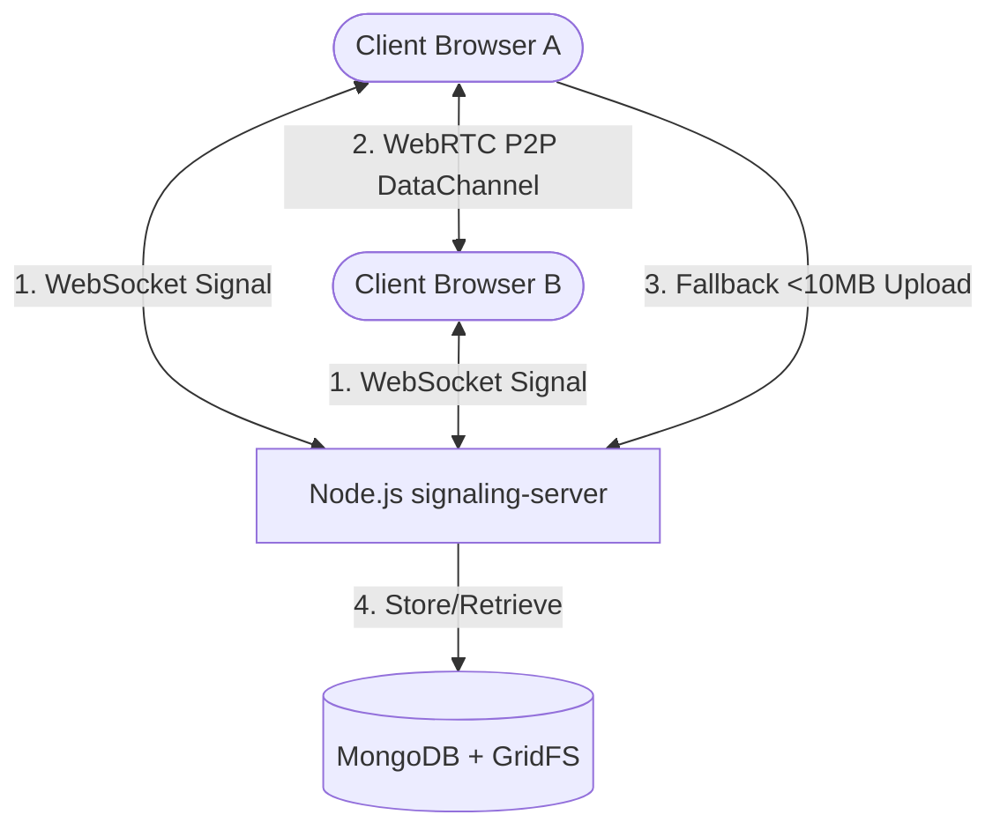

# ⚡ QuickShare

An ultra-fast, modern, secure file and text sharing application leveraging WebRTC for peer-to-peer transfers, backed by a robust MongoDB + GridFS storage engine for persistent transfers (<10MB).

Deploy and share files globally with premium UX, dynamic progress bars, and zero file size caps on peer-to-peer transfers!

---

## 🚀 Key Features

*   **⚡ Peer-to-Peer (WebRTC) Sharing:** Direct transfer of large files between browsers. No intermediary server means maximum transfer speed and total privacy.
*   **💾 GridFS Persistent Storage (<10MB):** Perfect for sharing smaller files, images, or text snippets persistently. Handled securely via Express, Multer, and MongoDB GridFS.
*   **☁️ Enterprise NAT Traversal (TURN):** Automatic fallback to Metered.ca STUN/TURN servers globally, ensuring P2P connections successfully bypass symmetric NATs and cellular firewalls.
*   **🔒 Rate Limiting & Safety:** Integrated express-rate-limit protecting upload endpoints and WebSocket handshake routes.
*   **🎨 Premium Glassmorphic UI:** A beautifully designed frontend built with React, Vite, and TailwindCSS/Vanilla CSS, complete with smooth animations, progress tracking, and error bubbling.

---

## 🛠️ Architecture



The application is split into two clean workspaces:
1.  **`client`**: React & Vite single-page application.
2.  **`signaling-server`**: Express, ws, and Mongoose WebSocket-driven backend.

---

## 📦 Local Setup & Development

### 1. Prerequisites
Ensure you have **Node.js v20+** installed on your machine.

### 2. Backend Setup
1.  Navigate to the backend directory:
    ```bash
    cd signaling-server
    ```
2.  Install dependencies:
    ```bash
    npm install
    ```
3.  Create a `.env` file based on `.env.example`:
    ```env
    PORT=3001
    MONGODB_URI=your_mongodb_atlas_uri
    ALLOWED_ORIGINS=http://localhost:3000
    METERED_API_KEY=your_metered_ca_api_key
    NODE_ENV=development
    ```
4.  Start the development server:
    ```bash
    npm run dev
    ```

### 3. Frontend Setup
1.  Navigate to the frontend directory:
    ```bash
    cd ../client
    ```
2.  Install dependencies:
    ```bash
    npm install
    ```
3.  Configure your environment in `.env`:
    ```env
    VITE_API_URL=http://localhost:3001
    ```
4.  Launch the development server:
    ```bash
    npm run dev
    ```
5.  Open your browser and navigate to `http://localhost:3000`.

---

## 🚢 Production Deployment

QuickShare is optimized for modern, zero-cost cloud hosting:

### 1. Frontend (Cloudflare Pages)
*   **Preset:** `Vite`
*   **Root Directory:** `client`
*   **Build Command:** `npm run build`
*   **Output Directory:** `dist`
*   **Environment Variable:** Set `VITE_API_URL` to your production backend URL.

### 2. Backend (Render / Railway)
*   **Root Directory:** `signaling-server`
*   **Build Command:** `npm run build` *(auto-triggers dependencies)*
*   **Start Command:** `npm start`
*   **Environment Variables:**
    *   `MONGODB_URI`: Your MongoDB Atlas URI.
    *   `ALLOWED_ORIGINS`: Your custom Cloudflare Pages domain (e.g. `https://quick-share.shooterdelta.tech`).
    *   `NODE_ENV`: `production`

---

## 📜 Scripts Reference

### Backend (`signaling-server`)
*   `npm run dev`: Start TypeScript development environment with hot reloading.
*   `npm run build`: Safely install package dependencies and compile TypeScript to static CommonJS/NodeNext modules.
*   `npm start`: Run the pre-built backend in production.

### Frontend (`client`)
*   `npm run dev`: Launch the local development dev server.
*   `npm run build`: Compile React files and produce static optimized production assets inside the `dist/` directory.