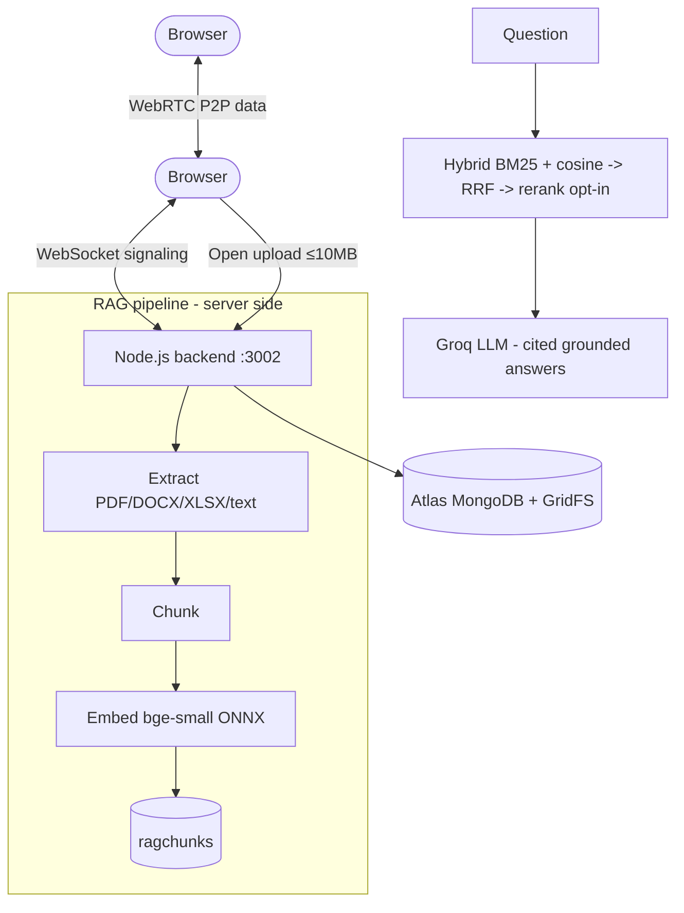

# ⚡ QuickShare

A fast, modern file & text sharing app: **WebRTC peer-to-peer transfers** for large files, **MongoDB GridFS** persistence (≤10MB) with an end-to-end encrypted **Private** mode, and a built-in **RAG AI agent** — ask questions about any shared session and get grounded, cited answers.

---

## 🚀 Key Features

* **⚡ Peer-to-Peer Sharing (WebRTC):** Direct browser-to-browser transfer with no size cap. The server only relays signaling — it never sees P2P content.
* **💾 Persistent Sessions (GridFS ≤10MB):** Files + text stored in MongoDB via Express/Multer/GridFS.
  * **🌐 Open sessions** — readable by code, automatically indexed server-side, **AI-questionable**.
  * **🔒 Private sessions** — client-side AES-256-GCM encryption (PBKDF2 100k). Server stores ciphertext only; AI features disabled by design.
* **🤖 RAG AI Agent:** Ask anything about a session's files/text. Pipeline: text extraction (PDF/DOCX/XLSX/code) → chunking → local ONNX embeddings (`bge-small`) → hybrid BM25+vector search → optional cross-encoder rerank → Groq LLM answer with inline citations and strict anti-hallucination refusal.
* **🔥 Burn-on-Read:** One-time sessions; recipient gets a grace window with files preloaded before self-destruction.
* **☁️ NAT Traversal:** Metered.ca STUN/TURN fallback (cached + rate-limited server-side).
* **🔒 Hardened by default:** Password-gated WebSocket joins (both roles), brute-force lockouts, proxy-aware rate limiting, bounded upload memory, timing-safe secret comparison, per-endpoint limiters.
* **🎨 Premium UI:** React + Vite, dark/light theme, QR pairing, live transfer progress, streaming chat drawer with source chips.

---

## 🛠️ Architecture


```mermaid
graph TD
    A([Browser]) <-->|WebSocket signaling| S[Node.js backend :3002]
    B([Browser]) <-->|WebRTC P2P data| A
    A -->|Open upload ≤10MB| S
    S --> M[(Atlas MongoDB + GridFS)]
    subgraph RAG pipeline [RAG pipeline - server side]
        S --> E[Extract PDF/DOCX/XLSX/text]
        E --> C[Chunk] --> EM[Embed bge-small ONNX]
        EM --> RC[(ragchunks)]
    end
    Q[Question] --> H[Hybrid BM25 + cosine -> RRF -> rerank opt-in]
    H --> G[Groq LLM - cited grounded answers]
```

Workspaces:
1. **`client`** — React/Vite SPA (+ `src/lib/rag` shared-safe logic for future P2P-side RAG).
2. **`signaling-server`** — Express + ws + Mongoose backend (`src/rag/` holds the AI pipeline).

---

## 📦 Local Setup & Development

### Prerequisites
**Node.js v20+**

### 1. Backend
```bash
cd signaling-server
npm install
```
Create `.env` (never committed):
```env
PORT=3002
MONGODB_URI=your_mongodb_atlas_uri
ALLOWED_ORIGINS=http://localhost:4000,https://your-production-domain
METERED_API_KEY=optional_metered_key
GROQ_API_KEY=gsk_your_free_groq_key
GROQ_MODEL=openai/gpt-oss-120b
NODE_ENV=development
```
> Free Groq key: [console.groq.com/keys](https://console.groq.com/keys) — no credit card. Without it the app works in **retrieval-only mode**: indexing/search fine, final answers disabled.

```bash
npm run dev     # ts-node-dev on :3002
```
First run downloads ~90MB of ONNX models (embedder), then serves from disk cache.

### 2. Frontend
```bash
cd ../client
npm install
```
Create `.env`:
```env
VITE_API_URL=http://localhost:3002
```
```bash
npm run dev     # pinned to http://localhost:4000 (strictPort)
```
> Client port is fixed at 4000 so the origin always matches backend `ALLOWED_ORIGINS`. Change both together if needed.

---

## 🤖 Using the AI agent

1. Publish an **🌐 Open** session (no password) — indexing starts automatically (`aiStatus → ready`, watch logs).
2. Recipient opens the join link/code → content renders → **"✦ Ask about these files"** drawer appears.
3. Ask anything: *"Summarise this"*, *"What's the oil change interval?"* → streamed Groq answer with `[file p.X]` source chips.
4. Questions outside the corpus get an honest refusal — no hallucinations.
5. 🔒 **Private** sessions show "AI features are off." — encryption means the server cannot read them, ever.

Rate limits: 10 queries / 15 min / IP. Without `GROQ_API_KEY`, `/ai/query` returns retrieval sources with `ai_not_configured`.

### Retrieval quality gate
```bash
cd signaling-server && npx tsc --module nodenext --moduleResolution nodenext \
  --target es2022 --skipLibCheck --strict false --outDir .evalbuild \
  scripts/rag-eval.mts src/rag/embedder.ts src/rag/chunker.ts src/rag/types.ts
node .evalbuild/scripts/rag-eval.mjs   # expect hit@3 ≥ 0.90 · current: 1.00
rm -rf .evalbuild
```

---

## 🚢 Production Deployment

### 1. Frontend (Cloudflare Pages)
| Setting | Value |
|---|---|
| Preset | Vite |
| Root Directory | `client` |
| Build Command | `npm run build` |
| Output Directory | `dist` |
| Env var | `VITE_API_URL=https://<your-backend-host>` |

### 2. Backend (Render free tier proven)
| Setting | Value |
|---|---|
| Root Directory | `signaling-server` |
| Build Command | `npm run build` |
| Start Command | `npm start` |

Environment variables:
| Var | Purpose |
|---|---|
| `MONGODB_URI` | Atlas connection string |
| `ALLOWED_ORIGINS` | Comma-separated frontend origins |
| `NODE_ENV` | `production` |
| `GROQ_API_KEY` | Enables AI answers (**must be set in the hosting dashboard** — `.env` is gitignored) |
| `GROQ_MODEL` | Default `openai/gpt-oss-120b` |
| `RAG_RERANK_ENABLED` | Leave unset on 512MB tiers (~400MB RAM). Opt-in on ≥1GB hosts |
| `NODE_OPTIONS` | Recommended: `--max-old-space-size=384` — GC before container OOM |

Notes: cold start downloads ~90MB ONNX weights once; boot logs warn if `GROQ_API_KEY` is missing ("retrieval-only mode").

---

## 📜 API quick reference

| Endpoint | Notes |
|---|---|
| `POST /publish` | multipart; no password ⇒ open/AI-enabled, password ⇒ private/E2EE |
| `PATCH /publish/:code` | update (requires old password if private) |
| `GET /retrieve/:code` | honors burn-on-read & expiry |
| `GET /file/:fileId/:token` | token-gated stream |
| `POST /session` · WS join | live P2P (password mandatory) |
| `GET /ai/status/:code` | `{aiStatus, llmConfigured}` |
| `POST /ai/query/:code` | `{question}` → `{answer, refused, sources[]}` |
| `GET /ice-servers` | cached STUN/TURN |
| `GET /health`, `GET /stats` | ops visibility (`/stats` needs `STATS_KEY`) |

## 🧯 Troubleshooting

| Symptom | Meaning / Fix |
|---|---|
| `AI answering needs the operator to configure GROQ_API_KEY` | Key missing in **hosting dashboard** env (gitignored `.env` doesn't deploy) |
| `AI is rate-limited…` | Free-tier quota or per-IP limiter — wait/retry |
| `This session has expired and was cleaned up.` | TTL passed (default 1h, max 10h) — publish again |
| `Indexing failed` | Check logs; re-publish retries. Unsupported binaries are skipped, not fatal |
| CORS errors in browser | Client origin must be listed in `ALLOWED_ORIGINS` (dev ports pinned: client 4000, server 3002) |

---

## 📜 Scripts Reference

### Backend (`signaling-server`)
* `npm run dev` — hot-reload dev server
* `npm run build` — compile TypeScript to `dist/`
* `npm start` — production runner

### Frontend (`client`)
* `npm run dev` — dev server (:4000)
* `npm run build` — type-check + production bundle to `dist/`
* `npm run lint` — ESLint

---

## 📄 License / privacy summary

Open-source project. Open sessions are stored unencrypted on the server and indexed for AI — do not put secrets in them. Use 🔒 Private mode for anything sensitive: content is encrypted in your browser, unreadable to the server, and excluded from all AI processing.
